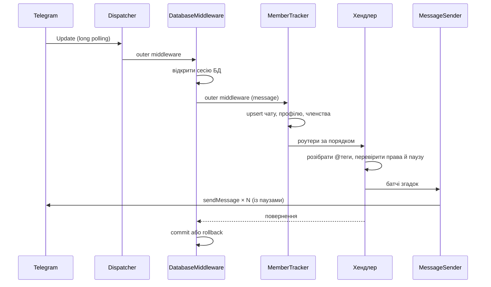

# Як це працює

Технічний опис: чому бот побудований саме так, які обмеження Telegram API на це
вплинули і що відбувається з кожним повідомленням.

---

## Задача і головне обмеження

Потрібно кликати людей у групі за роллю (`@devs`), а не за нікнеймом, і щоб це
працювало для тих, у кого `@username` немає взагалі.

Друга частина вирішується просто. Перша впирається в те, що визначає всю
архітектуру:

> **Telegram Bot API не має методу, який поверне список учасників групи.**

Доступно лише:

| Метод | Що дає |
|---|---|
| `getChatAdministrators` | тільки адмінів |
| `getChatMemberCount` | тільки число |
| `getChatMember(user_id)` | перевірку конкретної людини, якщо її id уже відомий |

Отримати повний склад можна лише через MTProto-клієнт під звичайним акаунтом
(Telethon/Pyrogram, `GetParticipants`) — це вже юзербот з окремою сесією й
ризиком обмежень акаунта. Тут цей шлях свідомо не використовується.

Тому бот **накопичує базу учасників самостійно**.

---

## Як зроблена сама згадка

Клікабельна згадка без юзернейма — це посилання на користувача за його id:

```html
<a href="tg://user?id=123456789">Оля</a>
```

Це еквівалент `MessageEntity` типу `text_mention`, але через HTML. Різниця
практична: `text_mention` вимагає рахувати `offset` і `length` у **UTF-16 code
units**, а не в символах Python — на емодзі та не-BMP символах це джерело
непомітних помилок зі зсувом згадки на сусіднє слово. HTML-варіант цього
класу помилок не має взагалі.

Реалізація — [bot/services/mention.py](../bot/services/mention.py). Імена
екрануються через `html.escape`, тож людина з ім'ям `<b>admin</b>` не зламає
розмітку.

---

## Звідки береться список учасників

П'ять незалежних джерел, бо жодне окремо не покриває всі випадки:

### 1. Усі, хто пише в чат — основне джерело

[`MemberTrackerMiddleware`](../bot/middlewares/tracker.py) перехоплює **кожне**
повідомлення групи ще до фільтрів роутерів і оновлює три записи: чат,
профіль користувача, факт членства.

Саме тому боту потрібен **вимкнений privacy mode**. З увімкненим (це стан за
замовчуванням) Telegram надсилає боту лише команди — і трекер не побачить
нікого, крім тих, хто пише команди.

Так база наповнюється за день-два звичайної активності групи.

### 2. Події `chat_member` — точні, але потребують адмінства

Дають миттєве й достовірне «зайшов»/«вийшов». Дві тонкощі:

- Telegram надсилає ці апдейти **лише ботам-адміністраторам**;
- вони **не входять у стандартний набір** апдейтів: якщо не попросити явно,
  вони не приходять, і це найпоширеніша причина «люди виходять, а бот їх усе
  ще кличе».

Тому в [bot/\_\_main\_\_.py](../bot/__main__.py) набір заданий явно:

```python
ALLOWED_UPDATES = [
    "message", "edited_message", "callback_query",
    "chat_member", "my_chat_member", "message_reaction",
]
```

### 3. Кнопка переклички — найдешевше для людини

`/rollcall` постить повідомлення з інлайн-кнопкою «Я тут»
([bot/handlers/rollcall.py](../bot/handlers/rollcall.py)). Натиск дає `user_id`
та ім'я через `callback_query` — людині не треба нічого писати, а чат не
засмічується. Закріплене повідомлення продовжує працювати місяцями й ловить
новачків.

У тексті показано прогрес («Вже знаю: 12 з 47»), але оновлення лічильника
throttled до одного разу на 5 секунд: інакше масове натискання перетворилося б
на потік `editMessageText` і вперлося б у ліміти.

### 4. Реакції — пасивний збір

`message_reaction` приносить `user_id` того, хто поставив емодзі. Люди й так
реагують, тож база наповнюється без жодних прохань. Дві умови: бот має бути
адміністратором і апдейт треба явно вказати в `allowed_updates` — як і
`chat_member`, за замовчуванням він не надсилається.

Коли реакцію ставлять анонімно від імені групи, Telegram надсилає `actor_chat`
замість `user` — такі події пропускаємо, реєструвати нікого.

### 5. Службові повідомлення — запасний шлях

`new_chat_members` / `left_chat_member` приходять як звичайні повідомлення й
працюють **навіть коли бот не адмін**. Вони дублюють події `chat_member` і
закривають випадок, коли адмінства ще не дали.

Обробка — [bot/handlers/chat_events.py](../bot/handlers/chat_events.py).

---

## Життєвий цикл апдейту



Ключові рішення:

- **Одна транзакція на апдейт.** [`DatabaseMiddleware`](../bot/middlewares/database.py)
  відкриває сесію, віддає її хендлеру через DI і робить `commit` після успішної
  обробки або `rollback` після винятку. Хендлери не думають про транзакції.
- **Трекер — саме middleware, а не хендлер.** Він має спрацювати на кожному
  повідомленні незалежно від того, чи знайдеться для нього хендлер.
- **Порядок роутерів має значення.** `mentions` ловить довільний текст, тож
  іде останнім — інакше він перехоплював би команди
  ([bot/handlers/\_\_init\_\_.py](../bot/handlers/__init__.py)).

---

## Що зберігається

SQLite, шість таблиць ([bot/db/models.py](../bot/db/models.py)):

| Таблиця | Призначення |
|---|---|
| `chats` | групи з їхніми налаштуваннями: політики, пауза, таймзона, тихі години |
| `users` | профіль: `user_id`, ім'я, `@username`, ознака бота |
| `chat_members` | хто в якому чаті: активність, прапорець `/mute_me` |
| `tags` | теги, унікальні **в межах чату** |
| `tag_members` | склад тегів |
| `mention_cooldowns` | коли тег востаннє викликали |

**Тексти повідомлень не зберігаються ніде.** Трекер бере з повідомлення лише
id, ім'я та юзернейм автора.

Два рішення, які варто пояснити:

- **Теги прив'язані до чату, а не глобальні.** Інакше `@devs` у двох різних
  групах був би тим самим тегом.
- **Cooldown лежить у БД, а не в пам'яті.** Інакше рестарт бота скидав би паузу
  й давав спосіб обійти обмеження.

Схема керується Alembic; міграції застосовуються автоматично при старті.

---

## Розкриття тегів

[bot/handlers/mentions.py](../bot/handlers/mentions.py) на кожному текстовому
повідомленні:

1. Витягує кандидатів регуляркою. Негативний lookbehind `(?<![\w@/])` відсікає
   e-mail (`vasyl@example.com`), подвійні `@@` і команди виду `/cmd@bot`.
2. Для кожного кандидата — чи це синонім `@all`, чи знаходиться тег у **цьому**
   чаті. **Невідомі `@слова` мовчки ігноруються** — саме тому бот не реагує на
   звичайні `@username`.
3. Перевіряє політику чату й паузу — окремо для кожного знайденого тега.
4. Збирає аудиторію в словник за `user_id` — дублікати між тегами зникають самі.
5. Не більше **3 згадок** на повідомлення.

Автор виклику завжди виключається зі списку — сам себе кликати не треба.

### Пошук тега за назвою або частиною

`find_tags` ([bot/db/repo/tags.py](../bot/db/repo/tags.py)) працює в три рівні й
зупиняється на першому, що дав результат:

| Рівень | Запит | `@dev` знайде |
|---|---|---|
| точний збіг | `name_lower = 'dev'` | лише `@dev`, якщо такий є |
| за початком назви | `name_lower LIKE 'dev%'` | `@devs`, `@devops` |
| за будь-якою частиною | `name_lower LIKE '%dev%'` | `@backend-dev` |

Порівняння завжди регістронезалежне: у `tags.name_lower` лежить нормалізована
назва, а запит проганяється через ту саму нормалізацію.

Три деталі, які легко проґавити:

- **Точний збіг має пріоритет.** Інакше тег `@dev` неможливо було б покликати
  окремо, поки в чаті існує `@devs`.
- **`_` і `%` екрануються.** У LIKE це шаблонні символи, а `_` — цілком легальний
  символ у назві тега: без екранування `qa_team` збігався б із `qaXteam`.
- **Ліміт `MAX_FUZZY_TAG_MATCHES = 5`.** Якщо частина назви підходить більшій
  кількості тегів, згадка не розкривається — бот просить уточнити. Без цього
  `@te` у чаті з десятком тегів підняв би пів групи.

Якщо неточна згадка дала кілька тегів, кожен з них проходить **власну** перевірку
паузи, а в заголовку відповіді перелічуються всі теги, які спрацювали — щоб було
видно, чому покликано саме цих людей.

Команди керування (`/tag_add`, `/tag_delete`, `/join`, …) використовують той
самий пошук через `resolve_tag_or_reply`
([bot/services/tag_lookup.py](../bot/services/tag_lookup.py)), але при кількох
збігах **не вгадують**: показують список і просять уточнити. Помилитися тегом у
`/tag_delete` дорожче, ніж дописати назву.

### Рідні теги Telegram (Bot API 9.5) — поки тільки збираємо

Bot API 9.5 (1 березня 2026) додав **теги учасників** — на відміну від
адмінських `custom_title`, вони доступні і звичайним членам:

- поле `tag` у `ChatMemberMember` і `ChatMemberRestricted`;
- поле `sender_tag` у `Message` — «Tag or custom title of the sender of the
  message; for supergroups only»;
- метод `setChatMemberTag`, права `can_manage_tags` / `can_edit_tag`.

Найцінніше тут — `sender_tag`: він приходить **у кожному повідомленні**, тож
трекер збирає теги без жодного додаткового виклику API, для всіх учасників, а
не лише для 50 адмінів.

Встановлена aiogram 3.22 (найновіша на PyPI) знає лише Bot API 9.2 і
типізованих полів не має. Але її моделі оголошені з `extra="allow"`, тож
невідомі поля лишаються в `model_extra` — читаємо їх звідти через
[bot/utils/api_extras.py](../bot/utils/api_extras.py). Доступ навмисно
зібраний в одному модулі: після оновлення aiogram перехід на нативні поля буде
точковим.

Одна деталь, на якій легко втратити дані: треба розрізняти **«поля немає»**
(Telegram не надсилає його цьому боту) і **«поле порожнє»** (тег справді
зняли). Тому хелпери повертають пару `(present, value)`, і трекер оновлює
`chat_members.telegram_tag` лише коли `present` — інакше старий Bot API стирав
би вже зібране.

### Згадка за рідним тегом

Якщо `@слово` не знайшлося серед власних тегів чату, парсер пробує рідні теги:
`find_users_by_telegram_tag` ([bot/services/tag_lookup.py](../bot/services/tag_lookup.py))
шукає це слово у званнях учасників.

Теги — довільні фрази («Mr Shishka Sun»), тож ті самі три рівні застосовано до
**слів усередині фрази** (`phrase_match_level` у
[bot/utils/text.py](../bot/utils/text.py)):

| Рівень | `@sun` знайде |
|---|---|
| точне слово | «Mr Shishka **Sun**», «BanGi **SUN**» |
| початок слова | за запитом `@shish` — «Mr **Shish**ka Sun» |
| будь-яке входження | за запитом `@дер` — «rydia ЛІ**ДЕР** MOON» |

Береться лише найточніший рівень, який дав результат: інакше `@sun` тягнув би
«Sunrise Crew» разом із тими, у кого «Sun» стоїть окремим словом.

Три властивості, що випливають із самої природи цих тегів:

- **Склад ніде не зберігається** — він обчислюється щоразу наново. Змінили
  звання в Telegram — змінився й склад згадки, синхронізувати нічого не треба.
- **Власні теги мають пріоритет**, бо їх створювали свідомо.
- **Пауза рахується окремо** (ключ `tg:<слово>`): у чаті можуть співіснувати
  власний тег `@sun` і звання «Sun», і блокувати один одного вони не повинні.

Фільтрація за словами робиться в Python, а не в SQL: учасників зі званнями —
десятки, максимум сотні, і витягти їх у пам'ять дешевше, ніж вигадувати запит
для пословного пошуку.

### Чим `@all` відрізняється від звичайного тега

`@all` віртуальний: у `tags` його немає, склад обчислюється запитом до
`chat_members` на момент виклику. Тому він працює одразу після додавання бота і
не потребує підтримки.

Фільтри при розкритті: активні учасники чату, крім ботів, крім `/mute_me`, крім
автора.

`/mute_me` **не впливає на іменні теги** — це свідомо. Масова розсилка й адресне
звертання до ролі — різні речі, і глушити треба лише першу.

---

## Доставка: батчі та ліміти

[bot/services/sender.py](../bot/services/sender.py):

- **Батчі по 6 згадок.** Не оптимізація, а обхід поведінки клієнтів: у
  повідомленні з десятками згадок нотифікацію отримують не всі згадані.
  5–8 працює стабільно.
- **Пауза 0.35 с між батчами** і **замок на чат**. Ліміт Telegram — близько 20
  повідомлень за хвилину на групу; замок гарантує, що два одночасні `@all` не
  перемішають батчі й не пробʼють ліміт удвох.
- **`429 Too Many Requests`** — очікування `retry_after` і до 3 спроб.
- **Реплай чіпляється лише до першого батча**, решта йде окремими
  повідомленнями. Якщо вихідне повідомлення встигли видалити — повтор без реплаю.
- **`403 Forbidden`** (бота вигнали чи заблокували) — чат позначається
  неактивним, бот перестає в нього писати.
- Довжина повідомлення контролюється за лімітом 4096 символів.

---

## Обмеження проти спаму

Це не «на майбутнє»: `@all` у групі на 150 людей без обмежень — найшвидший шлях
до того, що бота вимкнуть.

| Механізм | За замовчуванням | Де |
|---|---|---|
| Політика `@all` | лише адміни | `chats.all_policy` |
| Політика тегів | лише адміни | `chats.tag_policy` |
| Пауза на тег | 10 хв, окремо для кожного тега | `mention_cooldowns` |
| Особистий opt-out | `/mute_me` | `chat_members.muted_from_all` |
| Тихі години | 23:00–08:00, згадка без звуку | `chats.quiet_*` |
| Тегів на чат | до 100 | `MAX_TAGS_PER_CHAT` |

Перевірка адмінства ходить у `getChatAdministrators`, тому результат кешується
на 5 хвилин ([bot/services/policy.py](../bot/services/policy.py)) — інакше кожна
згадка коштувала б зайвий виклик API. Кеш скидається, коли бота прибирають із чату.

Окремо враховано **анонімних адмінів**: коли адмін пише від імені групи,
`from_user` підмінений на `GroupAnonymousBot`, тому перевірка додатково дивиться
на `sender_chat`.

Відмови («немає прав», «ще 4 хв») надсилаються **без звуку** — службове
повідомлення не має саме ставати спамом.

---

## Стійкість до збоїв

Правило просте: **жодна відмова Telegram не має спиняти бота**. Захист
багатошаровий, бо кожен шар закриває свій клас проблем.

### 1. Відповіді бота ніколи не кидають винятків

Усі відповіді йдуть через `safe_reply` / `safe_answer` / `safe_send`
([bot/utils/replies.py](../bot/utils/replies.py)), а не через `message.reply`
напряму. Хелпер розрізняє три ситуації:

| Ситуація | Поведінка |
|---|---|
| `TOPIC_CLOSED`, `CHAT_WRITE_FORBIDDEN`, немає прав, чат не знайдено | рядок у лог, обробка триває |
| «повідомлення для відповіді не знайдено» | повтор без реплая, звичайним постом |
| `429 Too Many Requests` | очікування `retry_after` і одна повторна спроба |
| мережа не відповіла | одна повторна спроба |

Це не теоретичний захист: саме `TOPIC_CLOSED` — команду написали в закритій темі
форуму — і був реальним випадком, коли виняток пройшов крізь усі шари нагору.

### 2. Глобальний обробник помилок

`@dispatcher.error()` ловить усе, що не спіймали хендлери, і **завжди** повертає
`True`. Відмови Telegram логуються одним рядком, будь-що інше — з повним
traceback, бо це вже наш баг.

### 3. Самовідновлюваний polling

`_run_polling_forever` ([bot/\_\_main\_\_.py](../bot/__main__.py)) перезапускає
цикл після будь-якого винятку з експоненційним backoff 1 → 2 → 4 → … → 60 с.
Якщо до збою бот пропрацював понад хвилину, пауза скидається до 1 с — збій був
разовий, довго чекати немає сенсу.

`asyncio.CancelledError` навмисно пропускається назовні: зупинка контейнера має
зупиняти, а не крутити цикл далі.

### 4. Heartbeat і healthcheck

Фоновий таск раз на 30 секунд оновлює `data/heartbeat`. Healthcheck контейнера
([deploy/healthcheck.py](../deploy/healthcheck.py)) перевіряє свіжість мітки й
розрізняє «процес живий» та «апдейти обробляються» — інакше зависання виглядало
б як нормальна робота.

Автопідйом після падіння процесу забезпечує `restart: unless-stopped`.

### 5. Захист від двох екземплярів

Telegram віддає апдейти лише одному отримувачу: друга копія з тим самим токеном
не подвоює продуктивність, а ламає обидві — `getUpdates` повертає `Conflict`, і
апдейти дістаються то одному процесу, то іншому.

Три заходи ([bot/utils/singleton.py](../bot/utils/singleton.py),
[bot/utils/log_filters.py](../bot/utils/log_filters.py)):

- **Файлове блокування** `data/bot.lock` через `flock`. Друга копія на тому
  самому сервері не стартує й пояснює причину. Блокування знімає сама ОС при
  завершенні процесу, тож `kill -9` не лишає по собі мертвий лок.
- **`delete_webhook` перед polling.** Колись налаштований webhook конфліктує з
  `getUpdates` мовчки — симптом той самий, а причина неочевидна.
- **Фільтр логів.** aiogram повторює спробу кожні ~5 с і щоразу пише ERROR; за
  годину це сотні однакових рядків. Лишається один зрозумілий рядок раз на
  хвилину з лічильником прихованих.

Від копії на **іншій** машині це не рятує — там допоможе лише зупинити зайвий
процес.

### Чого цей захист не робить

Він не приховує помилок: усе потрапляє в логи. І він не рятує від зовнішніх
причин — якщо бота вигнали з чату, повідомлення туди не дійде, скільки не
повторюй. Такі чати позначаються неактивними.

---

## Крайові випадки

**Група стає супергрупою.** Telegram видає новий `chat_id`, і всі дані, прив'язані
до старого, стають недосяжними. Обробляється `migrate_to_chat_id`: теги й
учасники переносяться на новий id, конфліктні дублі відкидаються
([bot/db/repo/chats.py](../bot/db/repo/chats.py)).

**Людина вийшла з чату.** Позначається неактивною і прибирається з тегів **цього**
чату. Профіль лишається — вона може бути в інших групах із цим ботом.

**Форуми (теми).** Відповідь надсилається в ту саму тему, звідки прийшов виклик.

**Зміна імені.** Профіль перезаписується на кожному повідомленні, тож у згадках
завжди актуальне ім'я. Довгі імена обрізаються до 32 символів.

**Бота додали в групу.** Надсилається привітання, а якщо `getMe` показує
увімкнений privacy mode — окреме попередження з інструкцією.

---

## Чому long polling, а не webhook

Webhook виправданий при великому потоці апдейтів. Тут він коштував би домену,
TLS-сертифіката з автопродовженням, реверс-проксі й відкритого порту — і
ламався б тихо: коли сертифікат протухає, Telegram просто перестає надсилати
апдейти, без жодної помилки з боку застосунку.

Long polling не потребує вхідних з'єднань, працює за NAT і фаєрволом,
перепідключається сам. Для бота на теги навантаження мізерне.

Перехід на webhook — це заміна `start_polling` у [bot/\_\_main\_\_.py](../bot/__main__.py);
решта коду не змінюється.

---

## Обмеження, які лишаються

Чесний перелік того, чого бот не вміє:

- **Не знає учасників, які ніколи не писали** і зайшли до появи бота в групі.
  Це наслідок обмеження Bot API, а не недоробка. `/stats` показує, скільки людей
  бот наразі знає.
- **З увімкненим privacy mode фактично марний** — бачить лише команди.
- **Без прав адміна** дізнається про вихід людей із затримкою (лише зі
  службових повідомлень).
- **SQLite** розрахований на десятки-сотні груп. Для істотно більшого масштабу
  знадобиться Postgres — код на SQLAlchemy до цього готовий, змінюється
  `DATABASE_URL` і діалект `insert` у репозиторіях.
- **Немає веб-інтерфейсу** — усе керування через команди в чаті.

---

## Структура коду

```
bot/
├── __main__.py       точка входу: polling, allowed_updates, DI
├── config.py         налаштування з .env (pydantic-settings)
├── constants.py      ліміти, зарезервовані назви
├── db/
│   ├── models.py     шість таблиць
│   ├── session.py    engine, PRAGMA foreign_keys/WAL
│   └── repo/         запити: chats, members, tags, cooldowns
├── handlers/         chat_events, tags, membership, settings, mentions, common
├── middlewares/      сесія БД на апдейт + трекер учасників
├── services/         збірка згадок, черга відправки, політики й тихі години
├── utils/            парсер тегів, робота з ентіті, час
└── migrations/       alembic
```

Роутери створюються фабриками `build_router()`, а не як модульні змінні: у
aiogram роутер можна приєднати лише один раз, тож глобальні екземпляри не давали
б зібрати другий `Dispatcher` у тому самому процесі — зокрема в тестах.

## Тести

```bash
.venv/bin/pytest        # 194 тести
```

- юніт-тести на парсер згадок, збірку батчів, тихі години, репозиторії;
- наскрізні: справжні `Update` проганяються крізь увесь стек — middleware, DI,
  розкриття `@all`, cooldown — з підміненим лише відправником
  ([tests/test_dispatcher.py](../tests/test_dispatcher.py)).
